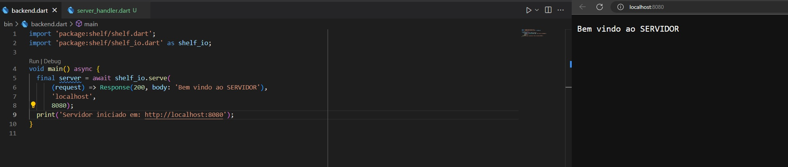
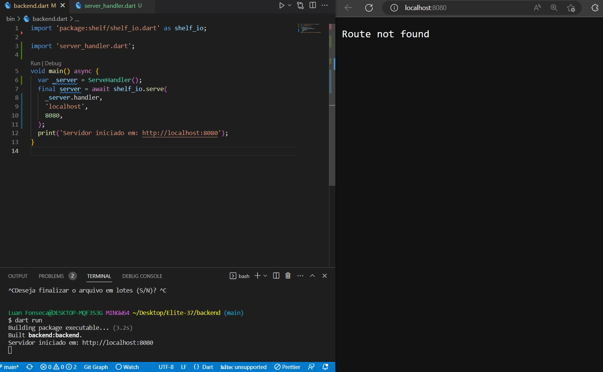
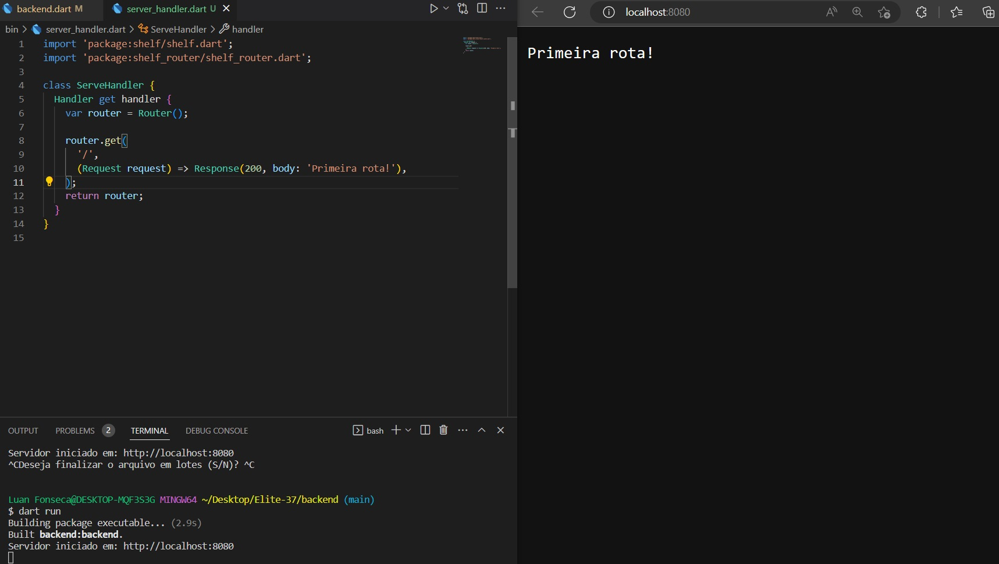
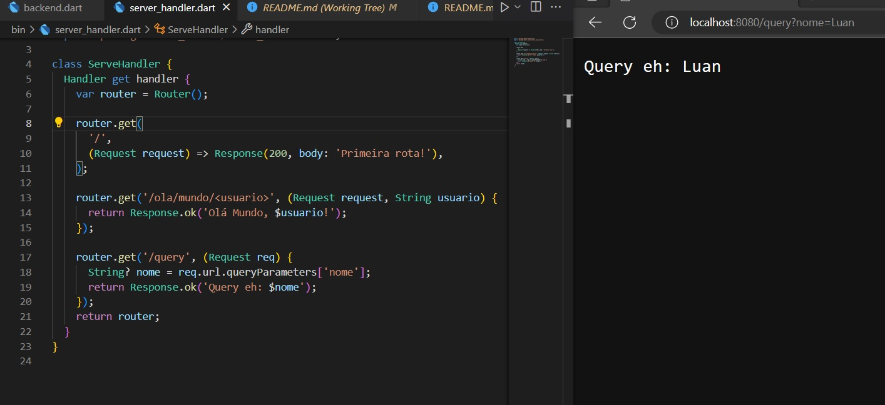

# :computer: Backend em Dart para Aplicação: Vagas

**Backend** desenvolvido em *Dart* para servir tanto ao **App Mobile** - acesso do Cliente, quanto a **página Web** - acesso do recrutador e administrador.

## Passos da Implementação

- Criação do Servidor
  - 
- Criação da Api
  - Rotas
  - 
    - GET '/'
      - 
    - POST '/login'
- Passagem de Dados com Query e Router Parms
  - Router param
    - obter parâmetro diretamente da url.Exemplo:  `http://localhost:8080/<variavel>`
  - Query parms
    - busca pelo parametro na url atraves da estrutura
      - ``String? nome = req.url.queryParameters['nome]``
      - Passagem por  ``http://localhost:8080/query?nome=Luan``
      - 
- Mime Type - JSon
- Cascade e PipeLine
- DotEnv
- Model Layer
- Service Layer
  - Isolamento da camada Service
- Middlewares
- Segurança
  - JWT
  - Encapsulamento da Segurança - Handler
- Injetor de Dependência
- Banco de Dados MySql
- Docker
- Conectar projeto DArt ao banco de dados
  - criação da abstração da conexão com o banco
  - Maperar modelos da consulta
- DAO Pattern - Isolando as consultas
- CRUD
- API -ponta a ponta
- Hash nas senhas
- Integração do Login
- CORS
- Deploy
