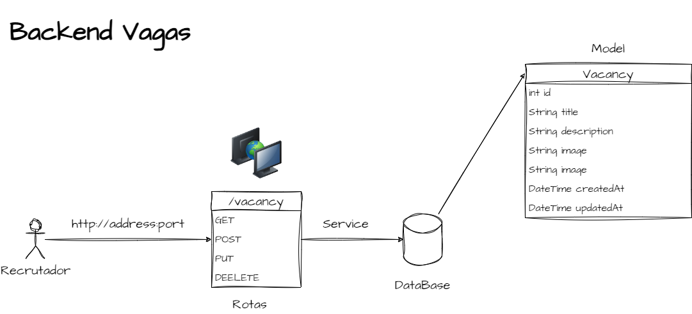
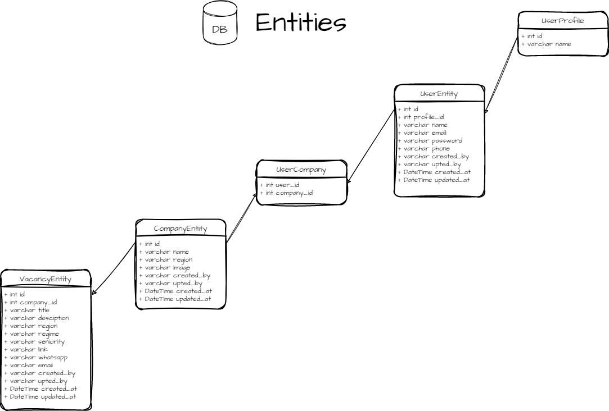

# :computer: Backend Aplicação: Vagas

Exercício de criação de **Backend** e **API-REST**, desenvolvido em *Dart*, para servir tanto ao **App Mobile** - acesso do Cliente, quanto a **página Web** - acesso do recrutador e administrador.

## Abstração Inicial



## Implementação

- [x] Criação do projeto dart
  - [`dart create backend`](https://dart.dev/tools/dart-create)

- [x] Instalação das dependências
  - [x] [shelf 1.4.0](https://pub.dev/packages/shelf)
  - [x] [shelf_router 1.1.3](https://pub.dev/packages/shelf_router)
  - [x] [dart_jsonwebtoken](https://pub.dev/packages/dart_jsonwebtoken)
  - [ ] [mysql1](https://pub.dev/packages/mysql1)

- [x] Criação do Servidor
  - [x] DotEnv - 'leitor de arquivos' que contém informações sensíveis.
  
- [x] Criação da Api (Controllers)
  - [x]  Encapsulamento da segurança e middlewares na interface da API (Controllers)
  - Rotas
  
    - [x] GET '/vacancy'
    - [x] POST '/vacancy'
    - [x] PUT '/vacancy'
    - [x] DELETE '/vacancy'

- [x] Model Layer
  - 

- Service Layer
  - Interface de Serviço Genérica
  - Isolamento da camada Service
- Middlewares
  - criação de middlewares com shelf `createMiddleware()`
  - criação de middlewares customizados
- [x] Mime Type : `application/json`

  ```dart
  Middleware get middleware => createMiddleware(
          responseHandler: (Response res) => res.change(
            headers: {'content-type': 'application/json'},
          ),
        );
  ```

- [x] verifica a existencia do token JWT

  ```dart
  Middleware get verifyJwt => createMiddleware(
          requestHandler: (Request req) {
            if (req.url.path == 'login') return null;
            if (req.context['jwt'] == null) {
              return Response.forbidden('Not Authorized');
            }
            return null;
          },
        );
    ```
  
- [x] valida Jwt - Permissão
  
  ```dart
  Middleware get authentication {
    return (Handler handler) {
      return (Request req) async {
        String? authorizationHeader = req.headers['Authorization'];

        JWT? jwt;

        if (authorizationHeader != null) {
          if (authorizationHeader.startsWith('Bearer ')) {
            String token = authorizationHeader.substring(7);
            jwt = await validateJWT(token);
          }
        }
        var request = req.change(context: {'jwt': jwt});
        return handler(request);
      };
    };
  }
  ```

- [x] Segurança
  - Interface de Segurança
    - Encapsulamento da segurança na interface da Api (Controller) através dos *middlewares*

      ```dart
      abstract class SecurityService<E> {
        Future<String> generateJWT(String userID);
        Future<E?> validateJWT(String token);

        Middleware get authentication;
        Middleware get verifyJwt;
      }
      ```

- [x] Implementação do contrato com JWT

- [x] Injetor de Dependência
  - [x] Criação da classe **DependencyInjector** Container de injeção de Dependência
  - [x] Criação da classe **Injects** que armazena os registros das instâncias

### A Desenvolver

- [ ] Banco de Dados MySql
- [ ] Docker
- [ ] Conectar projeto Dart ao banco de dados
  - [ ] criação da abstração da conexão com o banco
  - [ ] Mapear modelos da consulta
- [ ] DAO Pattern - Isolamento as consultas
- [ ] CRUD
- [ ] API - ponta a ponta
- [ ] Hash nas senhas
- [ ] Integração do Login
- [ ] CORS
- [ ] Deploy

### Relembrando Conceitos

- Passagem de Dados com Query e Router Parms
  - Router param
    - obter parâmetro diretamente da url.Exemplo:  `http://localhost:8080/<variavel>`
  - Query parms
    - busca pelo parametro na url atraves da estrutura
      - ``String? nome = req.url.queryParameters['nome]``
      - Passagem por  ``http://localhost:8080/query?nome=Luan``
  - body param
    - ``String body = await req.readAsString()``

- [Mime Type](https://developer.mozilla.org/en-US/docs/WebHTTP/Basics_of_HTTP/MIME_types/Common_types) - inseridos no headers da *Response* na chave `content-type`
  - *Exemplos*
  - ``content-type: application/json``
  - ``content-type: text/html``
- Cascade e PipeLine
  - [Builder - Pattern](https://refactoring.guru/design-patterns/builder)
  - 
