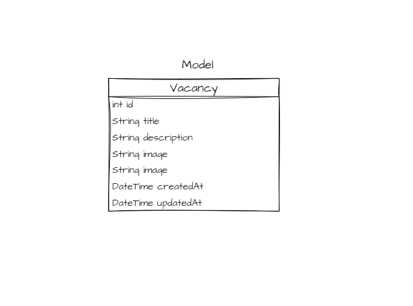

# :computer: Backend Aplicação: Vagas

Exercício de criação de **Backend** e **API-REST**, desenvolvido em *Dart*, para servir tanto ao **App Mobile** - acesso do Cliente, quanto a **página Web** - acesso do recrutador e administrador.

## Passos da Implementação

- [x] Criação do Servidor
  
- [x] Criação da Api
  - Rotas
  
    - GET '/vacancy'
    - POST '/vacancy'
    - PUT '/vacancy'
    - DELETE '/vacancy'
- Passagem de Dados com Query e Router Parms
  - Router param
    - obter parâmetro diretamente da url.Exemplo:  `http://localhost:8080/<variavel>`
  - Query parms
    - busca pelo parametro na url atraves da estrutura
      - ``String? nome = req.url.queryParameters['nome]``
      - Passagem por  ``http://localhost:8080/query?nome=Luan``
- [Mime Type](https://developer.mozilla.org/en-US/docs/WebHTTP/Basics_of_HTTP/MIME_types/Common_types) - inseridos no headers da *Response* na chave `content-type`
  - *Exemplos*
  - ``content-type: application/json``
  - ``content-type: text/html``
- Cascade e PipeLine
  - [Builder - Pattern](https://refactoring.guru/design-patterns/builder)
  - 
- [x] DotEnv
  - Desenvolvendo um 'leitor de arquivos' que contém informações sensíveis.
- [x] Model Layer
  - 
- Service Layer
  - Isolamento da camada Service
    - Interface de Serviço Genérica
- Middlewares
  - criação de middlewares com shelf `createMiddleware()`
  - criação de middlewares customizados
- Segurança
  - JWT
  - Encapsulamento da Segurança - Handler
- Injetor de Dependência
- Banco de Dados MySql
- Docker
- Conectar projeto DArt ao banco de dados
  - criação da abstração da conexão com o banco
  - Mapear modelos da consulta
- DAO Pattern - Isolamento as consultas
- CRUD
- API - ponta a ponta
- Hash nas senhas
- Integração do Login
- CORS
- Deploy
